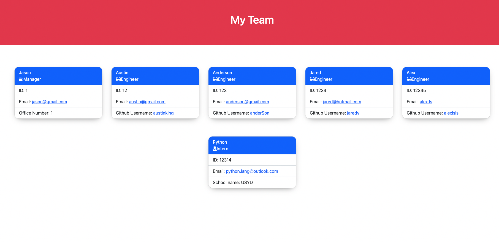

# Team Profile Generator

## Introduction

This project is a Node.js command-line application that takes in information about employees on a software engineering team. After uploading all information about your team, this application will generate a HTML webpage that displays summaries for each person. 

This project also involves an unit testing for every part of your code to make code maintainable.

## Tools

This application requires the use of the `Inquirer` package, ensure that you install and use Inquirer version 8.2.4. 

You need to use the following command in your project folder: `npm i inquirer@8.2.4`.

## Mock-Up

The following image shows a mock-up of the generated HTML’s appearance and functionality:

A walkthrough video can be found from a link below:
https://drive.google.com/file/d/1l9ctK-p3o-RUaZygJkQjO_KH6cXtsKie/view

